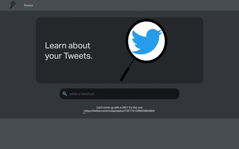
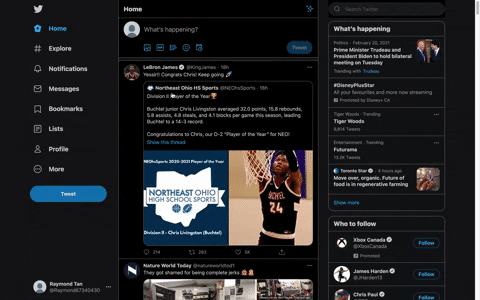
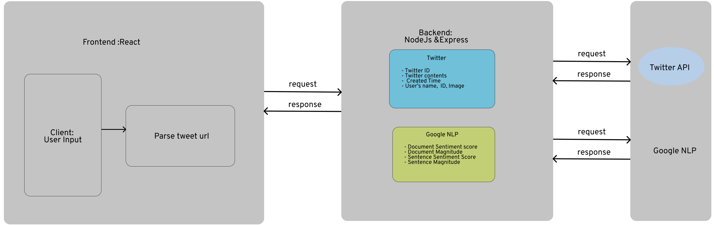

## Table of contents

- [Tweetsis](#tweetsis)
- [Demo](#demo)
- [Figma](#figma)
- [UML](#uml)
- [Frameworks and Libraries](#frameworks-and-libraries)
- [Setup](#setup)

## Tweetsis

A SPA(single page application) where users could input a tweet link and ouput a sentiment analysis of the Tweet's contents. The analysis is decomposed into 2 parts

1. The overall document and
2. each individual sentence

## Demo





## Figma

This [figma](https://www.figma.com/file/50TrKSMeIRGMlM3Wz9RYgG/Tweetsis?node-id=0%3A1) design shows the different progress and protoptyping of the project.

## UML



As the UML shows, the backend will retrieve data from the Twitter V2 API given the tweet url from the frontend, and it will send the tweet's contents to the Google NLP API, and will composite the response for easy frontend consumption. To acheive this, I started with express.js with one endpoint that consumes the tweet ID, a preprocessed ID from the url, as a parameter. The backend will request data about the tweet content and user information from the Twitter V2 API when the client enters a valid url, and will send the content to Google NLP API for sentiment analysis. After the pending of the asynchronous function is successed, then the data is well-formatted and send it to React components.

## Frameworks and Libraries

Project is created with:

- NodeJs version: v14.15.4
- Typescript : ^4.1.3,
- React: ^ 17.0.1
- Redux: ^4.0.5
- Chart.js": ^2.9.4,
- Tweetsis : v 1.0

## Setup

First, clone this project to your local machine using git clone:

```bash
$ git clone https://github.com/SegFault2017/Tweetsis.git
```

Next, before running the backend you need to create a `.env` file:

```bash
PORT=8080
NODE_ENV=
BEAR_TOKEN=
CORS_ORIGIN=http://localhost:3000
TWITTER_API_BASED_URL=https://api.twitter.com/2
GOOGLE_APPLICATION_CREDENTIALS=
```

The `Bear_TOKEN` is generated by the new app you created on your [Twitter account](https://developer.twitter.com/en/apply-for-access).

The `GOOGLE_APPLICATION_CREDENTIALS` is generated by [Googel Cloud Platform](https://cloud.google.com/?utm_source=google&utm_medium=cpc&utm_campaign=na-CA-all-en-dr-bkws-all-all-trial-e-dr-1009892&utm_content=text-ad-none-any-DEV_c-CRE_491349594430-ADGP_Desk+%7C+BKWS+-+EXA+%7C+Txt+~+Storage+~+Cloud+Storage_Cloud+_General-KWID_43700060013010330-kwd-46560699950&utm_term=KW_google%20cloud%20account-ST_google+cloud+account&gclid=Cj0KCQiA7NKBBhDBARIsAHbXCB7bGsRSxtUcGvasQVENmU1qUJR7OlbIhJu1pEUvxBCG1VX4NO87Yd8aAl-VEALw_wcB).

To run the backend, go to backend and install all the dependencies using npm:

```bash
$ cd ./backend
$ npm install
$ npm start
```

Last but not least, to run the frontend, go to frontend directory and install all the dependencies using npm:

```bash
$ cd ./frontend
$ npm install
$ npm start
```
